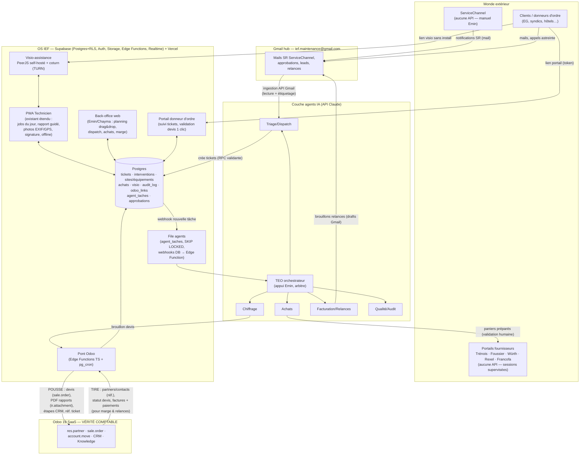

# AGENT D — ARCHITECTE LOGICIEL
## Dossier d'architecture P2 : « l'OS IEF » (§8 de la mission)
### Audit IEF & CO — 18/07/2026

---

## 0. LE FAIT QUI CHANGE TOUT : l'existant du dépôt `Synchroteam_IEF`

La mission décrit l'OS IEF comme un logiciel à concevoir. **C'est faux à ~35 %** : le dépôt git local `/home/user/Synchroteam_IEF` contient une plateforme « IEF Audit » développée, testée et déployable, dont l'ADN technique est exactement celui préconisé ici. État des lieux vérifié fichier par fichier :

| Brique existante | Fichiers clés | Verdict |
|---|---|---|
| Frontend React 18 + Vite + Tailwind + TanStack Query + React Router, code-splitting par route | `frontend/src/App.jsx`, `frontend/package.json` | **Réutilisable tel quel** — c'est le socle de l'OS IEF |
| Schéma Supabase multi-org avec RLS complète (organisations, users+rôles admin/technicien/client, sites, equipements, photos, rapports) | `supabase/migrations/0001` → `0005` | **Réutilisable tel quel**, à étendre (cf. §2) |
| Équipements multi-familles (porte, fenêtre, rideau métal, volet, portail, barrière, automatisme, accès) avec specs JSONB par famille + formulaires dédiés | `src/components/equipements/specs/*`, `lib/familles.js` | **Réutilisable tel quel** — couvre déjà le besoin « équipements par site » du §8 |
| Refs normalisées + QR code par équipement + scan caméra + planche QR imprimable | `lib/refBuilder.js`, `pages/ScanQr.jsx`, `pages/QrSheet.jsx` | **Réutilisable tel quel** |
| Signature tactile + snapshot d'audit hashé SHA-256 + versionning (comparaison d'audits à 6 mois) | `ui/SignaturePad.jsx`, `lib/hash.js`, `lib/diff.js`, migration `0004_audit_snapshots` | **Réutilisable tel quel** — la valeur probante (hash) est un différenciateur rare, à généraliser aux rapports d'intervention |
| PDF client (`@react-pdf/renderer`) | `lib/pdf.jsx` | **Réutilisable**, à décliner en gabarit « rapport d'intervention » (le gabarit actuel est un rapport d'audit) |
| Capture photo caméra native mobile + compression | `ui/PhotoCapture.jsx`, `lib/compress.js` | **À enrichir** : aucune extraction EXIF, pas d'horodatage/GPS stockés (la table `photos` n'a ni `taken_at` ni `lat/lng`) — exigence §8 non couverte |
| PWA offline (service worker, CacheFirst assets, NetworkFirst HTML) | `vite.config.js` | **À refactorer** : l'offline réel des DONNÉES repose sur `lib/localClient.js` (drop-in localStorage = mode dev), pas sur une file de synchronisation. Le « offline-first » revendiqué est vrai en mode local, partiel en mode Supabase. Il faut une outbox IndexedDB + resync (cf. §4) |
| Visio-assistance WebRTC (PeerJS), room technicien/client, capture d'images annotables | `lib/peerClient.js`, `pages/AssistanceRoom.jsx`, `JoinRoom.jsx`, `components/assistance/AnnotationCanvas.jsx` | **À refactorer** : broker PeerJS public (0.peerjs.com) + STUN Google seulement → échouera souvent en 4G/CGNAT. Il faut PeerServer self-hosté + TURN (coturn), ~1 conteneur. La logique métier (rooms, annotation, rattachement) est bonne — c'est précisément « le Kolus-like » demandé, déjà prototypé |
| Pré-devis (agrégation actions → lignes chiffrées, BPU statique, export CSV) | `pages/Devis.jsx`, `lib/bpu.js`, `lib/catalogue.js` | **À refondre** : BPU/catalogue codés en dur en JS avec taux horaire 55 €/h (incohérent avec la doctrine 60/110 €), export CSV au lieu de créer le devis dans Odoo. À migrer en tables DB + pont Odoo (famille IEF-F-XXX) |
| Dashboard, carte Leaflet des sites, recherche globale, import legacy JSON, tests E2E Playwright, ErrorBoundary | `pages/Dashboard.jsx`, `Carte.jsx`, `e2e/critical-path.spec.js` | **Réutilisable tel quel** — le harnais E2E est un actif majeur pour la maintenance par Claude Code |
| À jeter | `lib/backup.js` (export localStorage), auth mock du mode local en prod | Négligeable |

**Décision d'architecture n°1 — on n'écrit PAS un nouveau logiciel, on étend celui-là.** Justification : (a) le socle correspond trait pour trait aux exigences §8 (PWA, Supabase RLS, rôles, sites/équipements/historique, visio, QR, hash probant) ; (b) repartir de zéro coûterait 30-40 jours pour re-produire ce qui existe et re-stabiliser (les E2E passent) ; (c) le seul argument pour repartir de zéro serait un changement de paradigme (natif mobile, autre backend) — aucun n'est justifié pour 6 utilisateurs internes. Ce qui manque pour passer d'« IEF Audit » à « OS IEF » : le cœur FSM (tickets/interventions/planification/astreinte), le pont Odoo, le module achats/marge, le portail donneur d'ordre, la couche agents, l'audit trail générique. C'est l'objet des sections suivantes.

---

## 1. SCHÉMA D'ARCHITECTURE



### Sens de chaque flux (contrat d'intégration)

| Flux | Sens | Déclencheur | Contenu | Règle d'or |
|---|---|---|---|---|
| Gmail → OS IEF | entrant | webhook/poll 5 min (API Gmail, watch + history) | mails SR ServiceChannel parsés → ticket ; approbations devis → statut | le mail est archivé/étiqueté, jamais supprimé ; le ticket porte `source='servicechannel'` + n° SR |
| OS IEF → Odoo | sortant | événement métier (devis validé pour envoi, rapport clôturé) | création `sale.order` (lignes catalogue IEF-F-XXX), attachement PDF rapport sur la carte CRM, changement d'étape | **Odoo reste la vérité comptable** : l'OS n'écrit JAMAIS de facture ni de paiement ; il écrit devis + documents + étapes CRM, toujours via les fonctions validantes P1 (entité de facturation, livraison=site, n° SR en réf, TVA 20 %, prix non ronds) portées côté serveur |
| Odoo → OS IEF | entrant | pg_cron 15 min (delta sur `write_date`) | référentiel partners/contacts (lecture seule, cache local `clients`), statut devis (envoyé/accepté), factures et paiements | l'OS ne modifie jamais un client dans sa copie locale : correction → dans Odoo, resynchro |
| OS IEF ↔ PWA technicien | bidirectionnel | temps réel (Supabase Realtime) + outbox offline | jobs assignés ↓ ; rapports, photos, signatures, pointages ↑ | une intervention ne peut passer « terminée » sans rapport minimal (contrainte DB, pas discipline) |
| OS IEF ↔ Portail donneur d'ordre | bidirectionnel | lien token par mail | suivi tickets du client, validation devis 1 clic (horodatée = approbation) | le portail ne voit que `client_id` = le sien (RLS) ; la validation écrit un événement, c'est Odoo qui fait foi pour le devis |
| ServiceChannel | humain uniquement | — | Accept, saisies WO | inchangé : aucun accès API ; l'OS trace ce qu'Emin doit y faire (tâche « Accept SR » sur le ticket) |
| Fournisseurs | humain supervisé | agent Achats prépare | paniers, comparatifs ; les prix constatés sont saisis dans `prix_achat_historique` | aucune commande passée sans clic humain |

---

## 2. MODÈLE DE DONNÉES COMPLET (SQL Postgres / Supabase)

Principe : **on n'altère pas les 5 migrations existantes, on les prolonge** (`0006`+). Les tables existantes `organisations, users, sites, equipements, photos, rapports, audit_snapshots` sont conservées ; `sites` et `photos` sont étendues par `ALTER`. Toute écriture métier passe par des fonctions RPC `SECURITY DEFINER` validantes (transposition serveur, insautable, de la bibliothèque anti-erreur P1) ; les rôles applicatifs et agents n'ont pas d'INSERT direct sur les tables sensibles.

```sql
-- ============================================================
-- 0006_os_ief_core.sql — OS IEF : cœur FSM, achats, agents, Odoo
-- ============================================================

-- ---------- EXTENSIONS DE L'EXISTANT ----------
alter table public.users
  add column if not exists nom text,
  add column if not exists telephone text,
  add column if not exists actif boolean not null default true;
-- rôle enrichi : dirigeant > admin > technicien > client
alter table public.users drop constraint if exists users_role_check;
alter table public.users add constraint users_role_check
  check (role in ('dirigeant','admin','technicien','client','agent'));

-- CLIENTS : cache lecture-seule du référentiel Odoo (vérité = Odoo)
create table public.clients (
  id              uuid primary key default gen_random_uuid(),
  organisation_id uuid not null references public.organisations(id),
  odoo_partner_id integer unique,            -- res.partner (ex. EG parent = 9)
  nom             text not null,
  type            text not null default 'compte'
                  check (type in ('compte','syndic','hotel','particulier','autre')),
  entite_facturation_odoo_id integer,        -- ex. SAS EG RETAIL (FRANCE)
  regles          jsonb not null default '{}'::jsonb,
  -- ex. EG : {"nte_defaut":600, "unite_devis":"Unité/Forfait", "ref_client":"SR",
  --           "coordinateurs":["mehmet.d@...","nanndy.b@..."], "tva":20, "astreinte":true}
  actif           boolean not null default true,
  synced_at       timestamptz,
  created_at      timestamptz not null default now()
);

create table public.contacts (
  id          uuid primary key default gen_random_uuid(),
  client_id   uuid not null references public.clients(id) on delete cascade,
  odoo_partner_id integer,
  nom         text not null,
  role        text,                          -- 'coordinateur','cadre astreinte','syndic'…
  email       text, telephone text,
  created_at  timestamptz not null default now()
);

-- SITES : rattachement client + données terrain (les 492 EG entrent ici)
alter table public.sites
  add column if not exists client_id uuid references public.clients(id),
  add column if not exists code_site_client text,      -- n° station EG, réf. Savills…
  add column if not exists odoo_partner_id integer,    -- adresse de livraison Odoo
  add column if not exists acces_infos text,           -- codes, horaires, contact sur place
  add column if not exists sous_astreinte boolean not null default false;
create unique index if not exists sites_client_code_uk
  on public.sites(client_id, code_site_client) where code_site_client is not null;

-- PHOTOS : exigences terrain manquantes (horodatage, GPS, phase, rattachement intervention)
alter table public.photos
  add column if not exists intervention_id uuid,       -- FK ajoutée plus bas
  add column if not exists phase text
      check (phase in ('avant','pendant','apres','devis','sinistre')),
  add column if not exists taken_at timestamptz,       -- EXIF ou horloge device
  add column if not exists lat double precision,
  add column if not exists lng double precision,
  add column if not exists sha256 text;                -- intégrité probante
alter table public.photos alter column equipement_id drop not null;
alter table public.photos add constraint photos_rattachement_chk
  check (equipement_id is not null or intervention_id is not null);

-- ---------- TICKETS ----------
create sequence public.ticket_seq;
create table public.tickets (
  id              uuid primary key default gen_random_uuid(),
  organisation_id uuid not null references public.organisations(id),
  numero          text unique not null,                -- 'IEF-2026-00417' : LE n° universel
  client_id       uuid references public.clients(id),
  site_id         uuid references public.sites(id),
  equipement_id   uuid references public.equipements(id),
  source          text not null check (source in
    ('servicechannel','mail','telephone','astreinte','portail','whatsapp','interne','visio')),
  sr_number       text,                                -- n° SR EG ; NULL si astreinte en attente
  sr_attendu      boolean not null default false,      -- TRUE = astreinte sans SR → rattachement différé
  nte_ht          numeric(10,2),                       -- plafond NTE
  titre           text not null,
  description     text,
  urgence         text not null default 'normale'
                  check (urgence in ('normale','urgente','astreinte')),
  sla_echeance    timestamptz,
  statut          text not null default 'nouveau' check (statut in
    ('nouveau','qualifie','devis_en_cours','attente_approbation','commande_a_faire',
     'a_planifier','planifie','en_cours','termine','a_facturer','facture','clos','annule')),
  odoo_lead_id    integer,                             -- carte CRM Odoo liée
  gmail_thread_id text,                                -- fil du hub
  cree_par        uuid references public.users(id),
  created_at      timestamptz not null default now(),
  updated_at      timestamptz not null default now()
);
create index on public.tickets(statut);
create index on public.tickets(client_id, statut);
create index on public.tickets(sr_number) where sr_number is not null;
create index tickets_sr_attendu_idx on public.tickets(created_at)
  where sr_attendu and sr_number is null;              -- file « rattachement différé »

-- numérotation atomique à la création (transpose la règle myId, inviolable)
create or replace function public.next_ticket_numero() returns text
language sql as $$
  select 'IEF-' || to_char(now(),'YYYY') || '-' ||
         lpad(nextval('public.ticket_seq')::text, 5, '0');
$$;

-- ---------- INTERVENTIONS (jobs) ----------
create table public.interventions (
  id               uuid primary key default gen_random_uuid(),
  ticket_id        uuid not null references public.tickets(id),
  numero           text unique not null,               -- 'IEF-2026-00417-A'
  technicien_id    uuid references public.users(id),
  technicien_2_id  uuid references public.users(id),   -- binôme (tarif 110 €/h)
  scheduled_start  timestamptz,
  scheduled_end    timestamptz,
  statut           text not null default 'panier' check (statut in
    ('panier','planifiee','en_route','sur_site','terminee','validee','annulee')),
  arrivee_at       timestamptz, arrivee_lat double precision, arrivee_lng double precision,
  depart_at        timestamptz, depart_lat  double precision, depart_lng  double precision,
  synchroteam_id   text,                               -- legacy pendant migration
  created_at       timestamptz not null default now(),
  updated_at       timestamptz not null default now()
);
create index on public.interventions(technicien_id, scheduled_start);
create index on public.interventions(statut);
create index interventions_planning_idx
  on public.interventions(scheduled_start) where statut in ('planifiee','en_route','sur_site');
-- anti-collision planning : un technicien, un créneau
create extension if not exists btree_gist;
alter table public.interventions add constraint interv_no_overlap
  exclude using gist (
    technicien_id with =,
    tstzrange(scheduled_start, scheduled_end) with &&
  ) where (statut in ('planifiee','en_route','sur_site') and scheduled_start is not null);

alter table public.photos add constraint photos_intervention_fk
  foreign key (intervention_id) references public.interventions(id) on delete cascade;

-- RAPPORTS D'INTERVENTION (guidés par checklist métier)
create table public.checklist_modeles (
  id         uuid primary key default gen_random_uuid(),
  organisation_id uuid not null references public.organisations(id),
  nom        text not null,                            -- 'Dépannage rideau métallique'…
  famille    text,                                     -- lie aux familles d'équipements existantes
  version    integer not null default 1,
  items      jsonb not null,
  -- [{"id":"q1","label":"Cause de panne identifiée ?","type":"choix","options":[...],
  --   "obligatoire":true,"photo_requise":"avant"} …]
  actif      boolean not null default true,
  unique(organisation_id, nom, version)
);

create table public.rapports_intervention (
  id               uuid primary key default gen_random_uuid(),
  intervention_id  uuid unique not null references public.interventions(id),
  checklist_modele_id uuid references public.checklist_modeles(id),
  reponses         jsonb not null default '{}'::jsonb,
  travaux_realises text,
  reste_a_faire    text,
  pieces_utilisees jsonb not null default '[]'::jsonb, -- [{article_id, qte, bc_ligne_id}]
  signature_client_path text,                          -- Storage
  signataire_nom   text,
  signed_at        timestamptz,
  pdf_path         text,
  hash_sha256      text,                               -- réutilise lib/hash.js : valeur probante
  odoo_attachment_id integer,                          -- PDF poussé sur la carte Odoo
  created_at       timestamptz not null default now(),
  updated_at       timestamptz not null default now()
);

-- clôture impossible sans rapport signé ou motif explicite (contrôle STRUCTUREL)
create or replace function public.check_cloture_intervention()
returns trigger language plpgsql as $$
begin
  if new.statut = 'terminee' and old.statut is distinct from 'terminee' then
    if not exists (select 1 from public.rapports_intervention r
                   where r.intervention_id = new.id
                     and (r.signed_at is not null or r.travaux_realises is not null)) then
      raise exception 'Clôture refusée : rapport d''intervention manquant (ticket %)',
        (select numero from public.tickets where id = new.ticket_id);
    end if;
  end if;
  return new;
end $$;
create trigger trg_interv_cloture before update on public.interventions
  for each row execute function public.check_cloture_intervention();

-- HISTORIQUE PAR ÉQUIPEMENT (exigence §8 : « historique par équipement »)
create table public.equipement_evenements (
  id             uuid primary key default gen_random_uuid(),
  equipement_id  uuid not null references public.equipements(id) on delete cascade,
  type           text not null check (type in
    ('audit','panne','depannage','remplacement_piece','remplacement_complet',
     'maintenance_preventive','mise_en_securite','condamnation')),
  intervention_id uuid references public.interventions(id),
  ticket_id      uuid references public.tickets(id),
  resume         text not null,
  meta           jsonb not null default '{}'::jsonb,   -- {piece:'moteur Somfy RSX', cout_ht:…}
  occurred_at    timestamptz not null default now(),
  created_by     uuid references public.users(id)
);
create index on public.equipement_evenements(equipement_id, occurred_at desc);

-- ---------- ASTREINTE ----------
create table public.astreinte_gardes (            -- calendrier de garde 7j/7
  id           uuid primary key default gen_random_uuid(),
  organisation_id uuid not null references public.organisations(id),
  user_id      uuid not null references public.users(id),
  debut        timestamptz not null,
  fin          timestamptz not null,
  constraint garde_no_overlap exclude using gist
    (organisation_id with =, tstzrange(debut, fin) with &&)
);

create table public.astreinte_appels (            -- appel du cadre EG SANS ticket
  id           uuid primary key default gen_random_uuid(),
  ticket_id    uuid not null references public.tickets(id),  -- ticket créé immédiatement, sr_attendu=true
  appelant_nom text,                              -- ex. Pascal Baudel
  appelant_contact_id uuid references public.contacts(id),
  recu_at      timestamptz not null default now(),
  recu_par     uuid references public.users(id),
  resume_verbal text not null,
  sr_rattache_at timestamptz                      -- posé quand le SR arrive en semaine
);

-- ---------- ACHATS / FOURNISSEURS / MARGE ----------
create table public.fournisseurs (
  id        uuid primary key default gen_random_uuid(),
  organisation_id uuid not null references public.organisations(id),
  nom       text not null,                        -- Trénois, Foussier, Würth, Rexel, Francofa, Forum
  portail_url text, compte_client text,
  delai_livraison_jours integer,
  contact   jsonb not null default '{}'::jsonb,
  actif     boolean not null default true,
  unique(organisation_id, nom)
);

create table public.articles_fournisseur (        -- multi-catalogues
  id             uuid primary key default gen_random_uuid(),
  fournisseur_id uuid not null references public.fournisseurs(id),
  reference      text not null,                   -- réf. catalogue fournisseur
  designation    text not null,
  marque text, unite text not null default 'u',
  equivalents    jsonb not null default '[]'::jsonb, -- [{fournisseur_id, article_id}] comparateur
  odoo_product_id integer,                        -- lien variante IEF-F-XXX si vendue
  created_at     timestamptz not null default now(),
  unique(fournisseur_id, reference)
);

create table public.prix_achat_historique (       -- prix HISTORISÉS (jamais d'update, que des inserts)
  id           uuid primary key default gen_random_uuid(),
  article_id   uuid not null references public.articles_fournisseur(id),
  prix_ht      numeric(10,2) not null,
  source       text not null check (source in ('portail','devis_fournisseur','facture','saisie')),
  constate_at  timestamptz not null default now(),
  constate_par uuid references public.users(id)
);
create index on public.prix_achat_historique(article_id, constate_at desc);

create table public.devis_fournisseur (
  id             uuid primary key default gen_random_uuid(),
  fournisseur_id uuid not null references public.fournisseurs(id),
  ticket_id      uuid references public.tickets(id),
  reference      text, pdf_path text,
  total_ht       numeric(12,2),
  statut         text not null default 'recu'
                 check (statut in ('demande','recu','retenu','ecarte','expire')),
  valide_jusqu_au date,
  created_at     timestamptz not null default now()
);

create table public.devis_fournisseur_lignes (
  id           uuid primary key default gen_random_uuid(),
  devis_id     uuid not null references public.devis_fournisseur(id) on delete cascade,
  article_id   uuid references public.articles_fournisseur(id),
  designation  text not null, qte numeric(10,2) not null default 1,
  prix_unit_ht numeric(10,2) not null,
  -- RAPPROCHEMENT devis fournisseur ↔ ligne de devis CLIENT (exigence §8)
  odoo_sale_order_id      integer,               -- devis client Odoo
  odoo_sale_order_line_id integer                -- LA ligne client couverte par cet achat
);
create index on public.devis_fournisseur_lignes(odoo_sale_order_line_id);

create table public.bons_commande (
  id             uuid primary key default gen_random_uuid(),
  numero         text unique not null,            -- 'BC-2026-0089'
  fournisseur_id uuid not null references public.fournisseurs(id),
  ticket_id      uuid references public.tickets(id),
  devis_fournisseur_id uuid references public.devis_fournisseur(id),
  statut         text not null default 'brouillon' check (statut in
    ('brouillon','valide','commande','recu_partiel','recu','facture','annule')),
  total_ht       numeric(12,2),
  commande_at timestamptz, recu_at timestamptz,
  valide_par     uuid references public.users(id), -- validation humaine obligatoire
  created_at     timestamptz not null default now()
);

create table public.bc_lignes (
  id          uuid primary key default gen_random_uuid(),
  bc_id       uuid not null references public.bons_commande(id) on delete cascade,
  article_id  uuid references public.articles_fournisseur(id),
  designation text not null, qte numeric(10,2) not null,
  prix_unit_ht numeric(10,2) not null,
  odoo_sale_order_line_id integer                -- même rapprochement côté commande ferme
);

-- MARGE RÉELLE PAR AFFAIRE = ticket. Ventes tirées d'Odoo (cache), achats/MO locaux.
create table public.odoo_factures_cache (        -- alimenté par le pont (lecture seule)
  odoo_move_id  integer primary key,
  ticket_id     uuid references public.tickets(id),
  odoo_partner_id integer, numero text, type text check (type in ('facture','avoir')),
  total_ht numeric(12,2), total_ttc numeric(12,2),
  etat_paiement text, date_facture date, date_paiement date,
  synced_at     timestamptz not null default now()
);

create view public.v_marge_affaire as
select t.id as ticket_id, t.numero, t.client_id, t.statut,
  coalesce(fa.ca_ht,0)                                   as ca_facture_ht,
  coalesce(ach.achats_ht,0)                              as achats_ht,
  coalesce(mo.heures,0)                                  as heures_mo,
  round(coalesce(mo.heures,0) * 45, 2)                   as cout_mo_ht,   -- coût chargé interne, à calibrer
  round(coalesce(fa.ca_ht,0) - coalesce(ach.achats_ht,0)
        - coalesce(mo.heures,0)*45, 2)                   as marge_ht,
  case when coalesce(fa.ca_ht,0) > 0 then
    round(100*(fa.ca_ht - coalesce(ach.achats_ht,0) - coalesce(mo.heures,0)*45)/fa.ca_ht,1)
  end                                                    as marge_pct
from public.tickets t
left join (select ticket_id, sum(case when type='avoir' then -total_ht else total_ht end) ca_ht
           from public.odoo_factures_cache group by ticket_id) fa on fa.ticket_id = t.id
left join (select bc.ticket_id, sum(l.qte*l.prix_unit_ht) achats_ht
           from public.bons_commande bc join public.bc_lignes l on l.bc_id = bc.id
           where bc.statut not in ('brouillon','annule') group by bc.ticket_id) ach on ach.ticket_id = t.id
left join (select i.ticket_id,
             sum(extract(epoch from (i.depart_at - i.arrivee_at))/3600
                 * (1 + (i.technicien_2_id is not null)::int)) heures
           from public.interventions i where i.depart_at is not null group by i.ticket_id) mo
       on mo.ticket_id = t.id;

-- ---------- VISIO-ASSISTANCE (formalise l'existant) ----------
create table public.visio_sessions (
  id          uuid primary key default gen_random_uuid(),
  room_id     text unique not null,               -- généré par lib/peerClient.js
  ticket_id   uuid references public.tickets(id),
  intervention_id uuid references public.interventions(id),
  equipement_id uuid references public.equipements(id),
  host_user_id uuid references public.users(id),
  invite_nom  text, invite_telephone text,
  started_at  timestamptz not null default now(),
  ended_at    timestamptz, duree_secondes integer
);
create table public.visio_captures (
  id          uuid primary key default gen_random_uuid(),
  session_id  uuid not null references public.visio_sessions(id) on delete cascade,
  storage_path text not null, annotations jsonb,  -- AnnotationCanvas.jsx
  created_at  timestamptz not null default now()
);

-- ---------- MAPPING SYSTÈMES EXTERNES ----------
create table public.refs_externes (
  id           uuid primary key default gen_random_uuid(),
  systeme      text not null check (systeme in ('odoo','synchroteam','servicechannel','kolus','gmail')),
  modele       text not null,                     -- 'sale.order','res.partner','job','SR','thread'…
  external_id  text not null,
  entite       text not null,                     -- 'ticket','site','client','intervention','rapport'
  entite_id    uuid not null,
  meta         jsonb not null default '{}'::jsonb,
  synced_at    timestamptz not null default now(),
  unique(systeme, modele, external_id),
  unique(systeme, modele, entite, entite_id)
);
create index on public.refs_externes(entite, entite_id);

-- ---------- AUDIT TRAIL GÉNÉRIQUE (qui/quoi/avant/après, insautable) ----------
create table public.audit_log (
  id          bigint generated always as identity primary key,
  at          timestamptz not null default now(),
  auteur_id   uuid,                               -- users.id (humain OU agent)
  auteur_type text not null default 'humain' check (auteur_type in ('humain','agent','systeme')),
  agent_nom   text,                               -- 'triage','chiffrage'…
  table_name  text not null, row_id uuid,
  action      text not null check (action in ('insert','update','delete','rpc')),
  avant       jsonb, apres jsonb,
  rpc_nom     text, contexte jsonb
);
create index on public.audit_log(table_name, row_id);
create index on public.audit_log(at desc);
revoke update, delete on public.audit_log from authenticated, anon; -- append-only

create or replace function public.audit_trigger() returns trigger
language plpgsql security definer as $$
begin
  insert into public.audit_log(auteur_id, table_name, row_id, action, avant, apres)
  values (auth.uid(), tg_table_name,
          coalesce(new.id, old.id),
          lower(tg_op),
          case when tg_op in ('UPDATE','DELETE') then to_jsonb(old) end,
          case when tg_op in ('INSERT','UPDATE') then to_jsonb(new) end);
  return coalesce(new, old);
end $$;
-- appliqué à : tickets, interventions, rapports_intervention, bons_commande,
-- devis_fournisseur, astreinte_appels, clients, sites, equipements
-- (une boucle DO $$ ... $$ pose les triggers sur cette liste)

-- ---------- COUCHE AGENTS : FILE DE TÂCHES + APPROBATIONS ----------
create table public.agent_taches (
  id           uuid primary key default gen_random_uuid(),
  agent        text not null check (agent in
               ('teo','triage','chiffrage','achats','facturation','qualite')),
  type         text not null,                     -- 'ingest_mail','matcher_sr','pre_chiffrer',…
  payload      jsonb not null default '{}'::jsonb,
  ticket_id    uuid references public.tickets(id),
  statut       text not null default 'en_attente' check (statut in
               ('en_attente','en_cours','terminee','echec','attente_humain','annulee')),
  priorite     integer not null default 5,        -- 1 = astreinte
  tentatives   integer not null default 0,
  resultat     jsonb, erreur text,
  not_before   timestamptz not null default now(),
  created_at   timestamptz not null default now(),
  started_at timestamptz, finished_at timestamptz
);
create index on public.agent_taches(statut, priorite, not_before)
  where statut = 'en_attente';
-- worker : SELECT ... FOR UPDATE SKIP LOCKED (plusieurs workers sans collision)

create table public.approbations (
  id           uuid primary key default gen_random_uuid(),
  tache_id     uuid references public.agent_taches(id),
  ticket_id    uuid references public.tickets(id),
  type         text not null,                     -- 'envoi_devis','mail_sensible','remise','planif','bc'
  demandeur    text not null,                     -- agent
  approbateur_role text not null check (approbateur_role in ('dirigeant','admin')),
  -- dirigeant = Emin ; admin = Chayma/Kheira
  resume       text not null,                     -- ce que l'agent veut faire, en une phrase
  details      jsonb not null,
  statut       text not null default 'en_attente'
               check (statut in ('en_attente','approuvee','refusee','modifiee','expiree')),
  decideur_id  uuid references public.users(id),
  decide_at    timestamptz, commentaire text,
  created_at   timestamptz not null default now()
);
create index on public.approbations(statut, approbateur_role) where statut='en_attente';

-- ---------- PORTAIL DONNEUR D'ORDRE ----------
create table public.portail_tokens (
  token       uuid primary key default gen_random_uuid(),
  client_id   uuid not null references public.clients(id),
  contact_id  uuid references public.contacts(id),
  scope       text not null default 'suivi' check (scope in ('suivi','validation_devis')),
  ticket_id   uuid references public.tickets(id), -- token ciblé sur un devis précis
  expires_at  timestamptz not null default now() + interval '90 days',
  used_at     timestamptz,
  created_at  timestamptz not null default now()
);
```

**RLS (résumé — mêmes patterns que `0002_rls_policies.sql` existant)** : tout est scopé `organisation_id` via `current_org_id()` ; `technicien` ne voit que ses interventions + les sites/équipements associés, n'écrit que rapports/photos/pointages ; `client` (portail) ne lit que les tickets de son `client_id` (statuts filtrés, jamais les marges ni les achats) ; `agent` n'écrit RIEN directement — uniquement via RPC `SECURITY DEFINER` (`rpc_creer_ticket`, `rpc_planifier`, `rpc_rattacher_sr`, `rpc_pousser_devis_odoo`…) qui embarquent les validations P1 (les 7 points de contrôle) et journalisent dans `audit_log`. Les vues `v_marge_affaire`, `v_termine_non_facture` (jointure tickets `statut='a_facturer'` × cache factures) réservées à dirigeant/admin.

**Migration des 492 sites EG** : import CSV (export Synchroteam `site/list` paginé) → `clients` (EG, `odoo_partner_id=9`, `entite_facturation` = SAS EG RETAIL) + `sites` (name, adresse, `code_site_client` = n° station, lat/lng géocodés) — la route `/import` existante fournit le modèle de code.

---

## 3. CHOIX DE STACK ARGUMENTÉ

**Contrainte dimensionnante : « une stack que Claude Code peut construire et maintenir seul », pour ~6 utilisateurs internes + un portail léger.** Cela disqualifie d'office : microservices, Kubernetes, backend custom multi-langages, app mobile native (deux stores, signatures, délais de review). Cela privilégie : monolithe web, langage unique, services managés, tests E2E comme filet.

| Couche | Choix | Pourquoi (vs alternatives) |
|---|---|---|
| Frontend + PWA | **React 18 + Vite + Tailwind + TanStack Query** (existant) | Déjà écrit et testé ; l'écosystème le plus documenté = celui où Claude Code est le plus fiable. Alternative Next.js : inutile (pas de SEO, intranet), ajouterait un serveur à maintenir |
| Backend/DB/Auth/Storage/Realtime | **Supabase** (existant) | RLS = sécurité déclarée en SQL, auditable et testable ; Auth intégrée (magic link pour Jorge/Yanis, pas de mot de passe à gérer) ; Storage photos ; Realtime pour le planning ; Edge Functions TS pour le pont Odoo et les workers agents ; `pg_cron` pour les synchros. Alternative « VPS + Postgres + API Node maison » : +30 % de code à maintenir (auth, backups, migrations, monitoring) pour zéro gain fonctionnel. Souveraineté : projet en région **AWS eu-west-3 (Paris)** — données en France ; réversibilité totale (Postgres standard, `pg_dump`, Supabase est open-source et self-hébergeable si exigence contractuelle un jour) |
| Pont Odoo | **Edge Functions TypeScript** (JSON-RPC Odoo) + `pg_cron` 15 min | Réutilise les pièges §6 déjà documentés (create→liste, mail.compose.message, access_token uuid4). Un seul langage (TS) du front au pont = maintenable par Claude Code seul |
| Visio | **PeerServer + coturn self-hostés** (1 VPS) — code PeerJS existant conservé | Le broker public 0.peerjs.com et STUN-only ne tiennent pas en 4G/CGNAT. Plan B si qualité insuffisante : LiveKit Cloud (SDK JS, free tier généreux) — le code des rooms/annotations est indépendant du transport |
| PDF | `@react-pdf/renderer` (existant) côté client | Déjà en place ; pas de Puppeteer serveur à maintenir |
| Hébergement front | **Vercel** (config `vercel.json` existante) | Déploiement git-push, previews par PR (= revue visuelle d'Emin sans rien installer) |
| CI/CD & filet | **GitHub Actions + Playwright E2E** (existants) | LE mécanisme qui permet à Claude Code de maintenir seul : chaque changement passe les E2E avant merge |
| Agents IA | **API Claude (Sonnet pour le tri, Opus pour le chiffrage)** appelée par un worker Edge Function sur `agent_taches` | cf. §5 |
| Secrets | Supabase Vault + secrets Edge Functions ; **aucune clé côté client** ; clés Odoo/Gmail uniquement serveur | Exigence §8 « vault » couverte sans produit supplémentaire |

### Coûts de fonctionnement mensuels (réalistes PME)

| Poste | €/mois | Note |
|---|---|---|
| Supabase Pro | ~23 € (25 $) | 8 Go DB, 100 Go storage — large pour des années de photos compressées (`lib/compress.js`) |
| Vercel Pro | ~19 € (20 $) | le plan Hobby interdit l'usage commercial |
| VPS visio (PeerServer + coturn) — Hetzner/OVH | ~5-8 € | France/Allemagne ; bande passante TURN incluse à ce volume |
| Domaine + certificats | ~1 € | Let's Encrypt gratuit |
| API Claude (agents, hors abonnement TEO existant) | 20-80 € | ~50-150 tickets/mois triés + chiffrages ; Sonnet ≪ Opus, plafonnable par budget dur dans le worker |
| Sentry (erreurs) + GitHub | 0 € | free tiers suffisants |
| **Total OS IEF** | **≈ 70-130 €/mois** | |
| **Synchroteam économisé** | **≈ 100-170 €/mois** | 4-5 licences × 24-42 €/utilisateur/mois (tarif public) ≈ 1 200-2 000 €/an |

Lecture honnête : **l'économie d'abonnement couvre l'infrastructure, mais ce n'est pas l'argument** — à ±50 €/mois près c'est neutre. Le vrai ROI est fonctionnel : marge réelle par affaire visible (aujourd'hui invisible), zéro re-saisie rapport→Odoo (aujourd'hui le rituel du soir de TEO), rattachement SR automatisé, portail client, et la fin des limites structurelles de Synchroteam (myId verrouillé, `site/list` qui ne filtre pas) et de Kolus (crmId non settable).

---

## 4. INTERFACE TECHNICIEN MOBILE (PWA)

Écrans cibles et couverture par l'existant :

| Écran / capacité §8 | Existant | À construire |
|---|---|---|
| **Jobs du jour** (liste triée, détail site, itinéraire) | rien (l'app actuelle est orientée audit de site) | page `MesJobs.jsx` : requête `interventions` du technicien connecté (RLS fait le filtre), tri par `scheduled_start`, badge urgence/astreinte. **Navigation** : lien `https://maps.google.com/?daddr=lat,lng` — les sites ont déjà lat/lng (migration `0005`) ; zéro SDK à intégrer |
| Arrivée / départ sur site | rien | 2 boutons → `rpc_pointer(intervention_id, 'arrivee'|'depart')` avec `navigator.geolocation` → alimente `arrivee_at/lat/lng` (base des heures MO de la marge) |
| **Photos avant/après horodatées géolocalisées** | `PhotoCapture.jsx` (caméra native) + `compress.js` + upload Storage : 80 % fait | ajouter au flux d'upload : sélecteur de phase avant/après (2 boutons, pas un menu), extraction EXIF (`exifr`, lib légère) avec repli sur horloge+GPS du device, calcul `sha256` (réutilise `lib/hash.js`), écriture `taken_at/lat/lng/phase` |
| **Rapport guidé par checklist métier** | formulaires specs par famille (`SpecsRouter.jsx`) = le pattern UI existe | moteur de rendu de `checklist_modeles.items` (JSONB → composants ChipSelect/champ existants) ; blocage de clôture si item `obligatoire` vide ou `photo_requise` manquante — miroir client du trigger DB |
| **Signature client** | `SignaturePad.jsx` complet (pointer events, touch/stylet) | brancher sur `rapports_intervention.signature_client_path` + nom signataire + re-générer le PDF avec hash (pattern `audit_snapshots` déjà écrit) |
| Scan QR équipement → historique | `ScanQr.jsx` + QR par équipement complets | afficher `equipement_evenements` (timeline) au scan — le technicien voit les pannes passées AVANT de diagnostiquer |
| Visio-assistance depuis le job | rooms + annotation faits | lier la room au ticket (`visio_sessions`), bouton « Appeler Emin en visio » depuis l'écran job (traite aussi le canal WhatsApp : la capture annotée est DANS le dossier) |
| **Mode hors-ligne** | SW PWA (assets) OK ; données : seulement le mode dev localStorage | **le vrai chantier** : outbox IndexedDB (Dexie) — les jobs du jour sont pré-chargés au matin (TanStack Query `persistQueryClient`), toute écriture (rapport, photo, pointage, signature) passe par une file locale rejouée au retour réseau, statut « en attente de synchro » visible. Résolution de conflit simple : le rapport du technicien gagne toujours (il est seul écrivain de son intervention). L'interface de `localClient.js` (même API que supabase-js) prouve que l'app est déjà découplée du transport : l'outbox se glisse au même endroit |

UX imposée par le terrain : boutons ≥ 48 px, saisie par chips (existant), zéro texte libre obligatoire sauf « travaux réalisés », dictée vocale native du clavier suffisante (pas de STT custom en V1). Jorge est le testeur pilote : s'il clôture un rapport en < 3 min sur site, c'est gagné.

---

## 5. COUCHE AGENTS IA

### Mécanisme technique (réponse à « file en DB ou webhooks ? » : **les deux, chacun à sa place**)

1. **Entrées → tâches** : le poll Gmail (pg_cron 5 min, Edge Function) et les webhooks DB Supabase (ex. INSERT ticket urgent) créent des lignes `agent_taches`. La file en DB est la source de vérité : rejouable, priorisée, auditée — un webhook seul se perd, une ligne en base jamais.
2. **Worker** : Edge Function `agent-worker` (déclenchée par pg_cron 1 min + par webhook pour la latence) : `SELECT … FOR UPDATE SKIP LOCKED` → construit le prompt (contexte = ticket + règles client depuis `clients.regles`, PAS la doctrine entière → économie de tokens structurelle, cohérente avec P1/Agent B) → appelle l'API Claude avec **tools = uniquement les RPC autorisées à cet agent** → écrit `resultat` ou crée une `approbation`.
3. **Garde-fous structurels** (le pattern racine §5 de la mission — « l'exécution précède le contrôle » — est inversé ici) :
   - chaque agent = un utilisateur `role='agent'` dédié ; **aucun GRANT d'écriture sur les tables**, seulement EXECUTE sur SES RPC ;
   - les RPC valident (les 7 points de contrôle P1 en SQL : entité de facturation, livraison=site, n° ticket, prix non ronds, TVA 20 %…) et **lèvent une exception sinon** — un agent ne PEUT PAS écrire un devis EG sans SR en référence ;
   - toute action au-dessus du seuil crée une `approbation` et met la tâche en `attente_humain` ; l'UI back-office affiche la corbeille d'approbations (Emin : 30 s par décision, sur mobile) ;
   - budget tokens/jour par agent dans le worker (coupe-circuit) ; `audit_log` trace chaque RPC avec `auteur_type='agent'`.
4. **TEO orchestrateur** : reste l'interface conversationnelle d'Emin (vocal). Différence avec aujourd'hui : TEO ne « fait » plus par API brute, il **poste des tâches dans la même file et lit les mêmes vues** — même trace, mêmes garde-fous, plus aucune action hors journal. Le registre 169 (dossiers ouverts) devient la vue `tickets where statut not in ('clos','annule')` : la mémoire n'est plus un texte à relire, c'est l'état de la base.

### Périmètres par agent (frontières exactes)

| Agent | Écrit via RPC (périmètre exact) | Fait SEUL | Exige **Emin** (dirigeant) | Exige **Chayma** (admin) |
|---|---|---|---|---|
| **Triage/Dispatch** | `rpc_creer_ticket`, `rpc_rattacher_sr`, `rpc_proposer_planif` (statut `panier`→proposition), étiquettes Gmail | créer tickets depuis mails SR/clients ; matcher SR entrant ↔ tickets `sr_attendu` (score site+date+description, auto si score fort, sinon approbation) ; proposer un créneau+technicien | toute planification FERME (le job n'est `planifiee` qu'après clic — leçon erreur n°4 « job calé sur inférence ») ; tout ce qui touche l'astreinte ; Accept ServiceChannel (reste 100 % manuel) | — |
| **Chiffrage** | `rpc_creer_devis_brouillon` (sale.order **brouillon** Odoo, lignes catalogue IEF-F-XXX), `rpc_creer_variante_produit` | pré-chiffrer depuis rapport/photos/BPU + prix d'achat historisés ; vérifier NTE ; préparer le mail de proposition (brouillon) | **envoi de TOUT devis** (règle absolue V1 ; relâchable plus tard sous 500 € HT sur décision d'Emin) ; toute remise ; tout devis > NTE ou > 3 000 € HT ; premier contact ; sinistre | — |
| **Achats** | `rpc_creer_bc_brouillon`, `rpc_enregistrer_prix` (append-only), `rpc_lier_ligne_achat_vente` (rapprochement) | comparer les prix multi-catalogues ; historiser ; préparer les paniers (session navigateur supervisée) ; alerter si marge prévisionnelle < seuil | BC > 500 € HT ; tout nouveau fournisseur ; toute commande urgente | valider BC ≤ 500 € HT ; confirmer réceptions |
| **Facturation/Relances** | `rpc_marquer_a_facturer`, `rpc_preparer_relance` (draft Gmail, jamais d'envoi direct), lecture `v_termine_non_facture` | détecter interventions terminées non facturées (J+2 = alerte) ; préparer relances devis J+5/J+12/J+30 et factures impayées ; rapprocher paiements (cache Odoo) | relance à un compte stratégique (EG, Astotel) ; tout litige ; tout avoir | **émettre les factures dans Odoo** (l'OS ne crée JAMAIS de facture) ; envoyer les relances standard préparées |
| **Qualité/Audit** | `rpc_creer_constat` (table de constats), rien d'autre — **lecture seule sur tout** | recalculer chaque nuit les 4 compteurs hebdo P1 + délai d'encaissement + taux de transformation ; détecter les violations (rapport sans photo « après », ticket sans SR à J+7, écart devis/facturé) ; produire la revue du vendredi (alimente le classeur Excel existant) | arbitrer les constats ; amender la doctrine | corriger les anomalies de saisie |

Règle transverse : **un agent n'envoie jamais rien à un humain externe** (mail, devis, commande). Il prépare ; un humain déclenche. C'est la transposition structurelle du « cran d'arrêt mails sensibles » P1 — mais élargie à 100 % des sorties, puis relâchée métier par métier sur décision explicite d'Emin, mesurée par l'agent Qualité.

---

## 6. DÉCOUPAGE MVP → V1 → V2

### Challenge de la suggestion « rapport technicien mobile + photos »

La mission désigne ce maillon comme MVP « car le plus faible aujourd'hui ». **C'est à moitié vrai, et l'existant change le calcul** : (a) IEF Audit couvre déjà ~70 % du rapport mobile (photos, équipements, signature, PDF, hash) ; (b) Synchroteam fait déjà un rapport mobile passable — le remplacer à l'identique ne supprime aucune douleur, il en déplace une ; (c) la douleur RÉELLE documentée (§4-5 de la mission) n'est pas la saisie du rapport, c'est **ce qui se passe autour** : le rapprochement du soir rapport→carte Odoo fait à la main par TEO, le myId oublié irrécupérable, l'intervention terminée non facturée, le SR d'astreinte à rattacher.

**MVP retenu : « le dossier d'intervention de bout en bout », pas « le rapport »** — ticket numéroté à la création (le n° universel devient structurel, l'erreur myId disparaît par construction) → job assigné → rapport mobile guidé signé → **PDF poussé automatiquement sur la carte Odoo + ticket basculé `a_facturer`**. C'est le chemin le plus court qui supprime une douleur quotidienne mesurable (le rituel du soir + le risque de non-facturation) tout en posant la colonne vertébrale de la sortie de Synchroteam. Le pont Odoo en écriture est volontairement minuscule en MVP (attacher un PDF + noter une étape) : risque faible, valeur immédiate.

### MVP (8 semaines calendaires) — périmètre fermé
- Tables : clients, extension sites, tickets, interventions, rapports_intervention, checklist_modeles (2 modèles : dépannage serrurerie, rideau métallique), extension photos, audit_log, refs_externes. Import des 492 sites EG + clients actifs.
- PWA : MesJobs, pointage arrivée/départ, rapport guidé, photos avant/après EXIF/GPS, signature, PDF (adaptation `pdf.jsx`), outbox offline **minimale** (rapport+photos seulement).
- Back-office : liste tickets/statuts, création ticket manuelle (Emin/Chayma/TEO), assignation simple (pas encore de drag & drop).
- Pont Odoo v0 : pull partners (cache clients), push PDF rapport sur la carte, note d'étape.
- **Fonctionnement en DOUBLE PISTE avec Synchroteam 4-6 semaines** (jobs miroirs via `refs_externes.synchroteam_id`) : Jorge pilote sur l'OS, Yanis reste sur Synchroteam, bascule quand 20 rapports réels sont passés sans accroc.
- Critère de sortie : plus aucun rapprochement manuel du soir sur les jobs pilotes ; zéro intervention pilote terminée non facturée à J+2.

### V1 (MVP + 3-4 mois) — remplace Synchroteam, résiliation
- Planification drag & drop (semaine × techniciens, contrainte anti-collision DB déjà posée), file panier, calendrier d'astreinte + tickets `sr_attendu` + matching SR (RPC + agent Triage).
- Agents Triage/Dispatch et Facturation/Relances en production (mécanisme §5 complet : file, worker, approbations).
- Visio durcie : PeerServer + coturn self-hostés, sessions liées aux tickets, captures annotées dans le dossier.
- Pont Odoo v1 : devis brouillons depuis le chiffrage (agent Chiffrage en mode « prépare seulement »), cache factures/paiements, vue `v_termine_non_facture` en dashboard.
- Portail donneur d'ordre v0 : lien token « suivi de MES tickets » + validation devis 1 clic (EG coordinateurs, syndics).
- Migration Synchroteam complète (cf. risques §8) puis résiliation.

### V2 (V1 + 4-6 mois) — le système complet
- Module achats complet : catalogues fournisseurs, prix historisés, devis fournisseurs, BC, rapprochement ligne à ligne, **marge réelle par affaire** en dashboard dirigeant.
- Agents Chiffrage/Achats/Qualité en production ; relâchement progressif des seuils d'approbation, mesuré.
- Historique équipements enrichi (timeline au scan QR), maintenance préventive (gammes + génération automatique de tickets récurrents), comparatifs d'audits (le `diff.js` existant) vendus comme service aux clients patrimoine.
- Portail v1 : historique interventions, rapports téléchargeables, demande d'intervention (nouveau canal entrant → moins de WhatsApp).

---

## 7. ESTIMATION DE CHARGE ET COÛTS

Hypothèse de production : Claude Code développe, **Emin revoit via previews Vercel + E2E Playwright en CI** (il ne relit pas le code, il teste le produit — les E2E sont le relecteur de code). Jours = sessions de développement effectives.

| Phase | Dev Claude Code | Revue Emin | Calendrier |
|---|---|---|---|
| MVP | 20-25 j | 8-10 × 1 h (fin de sprint hebdo + tests terrain avec Jorge) | 8 semaines |
| V1 | 35-45 j | ~1 h/semaine + 2 j migration/bascule | +3-4 mois |
| V2 | 30-40 j | ~1 h/semaine | +4-6 mois |
| **Total** | **85-110 j** | **~25-30 h** | **12-14 mois** |

Coûts : développement = abonnement Claude (Max ~90-180 €/mois pendant le dev, déjà partiellement en cours pour TEO) — soit un coût total de développement de l'ordre de **2 000-3 000 €** là où un prestataire externe facturerait 60-120 k€ pour ce périmètre. Fonctionnement : 70-130 €/mois (§3), ~compensé par la résiliation Synchroteam à V1. Aucun CAPEX.

---

## 8. RISQUES ET PARADES

| # | Risque | Gravité | Parade concrète |
|---|---|---|---|
| 1 | **Dépendance à un développeur unique** — précédent Mehdi (prestataire externe parti avec la connaissance) ; ici le « développeur » est Claude Code, la dépendance se déplace vers Anthropic + la capacité d'Emin à piloter | Haute | Stack ultra-mainstream (React/Postgres/Supabase = des milliers de devs et n'importe quel LLM concurrent peuvent reprendre) ; tout dans UN repo Git avec migrations SQL versionnées, `CLAUDE.md` d'architecture, E2E qui documentent le comportement ; **test de réversibilité semestriel** : un dev tiers (ou un autre modèle) doit monter l'app depuis le README en < 1 h ; export `pg_dump` hebdo automatique hors Supabase (Storage S3 OVH) |
| 2 | **Migration Synchroteam** : myId absents sur d'anciens jobs (irrécupérables post-clôture), historique à préserver, `site/list` qui ne filtre pas | Haute | **Extraction COMPLÈTE dès le MVP, sans attendre la bascule** : script paginé `job/list` + rapports + `site/list` (filtrage local, piège §6 connu) → tables `legacy_synchroteam_*` en lecture seule ; réconciliation myId↔tickets par heuristique (site+date+client) avec file de cas douteux arbitrés par Chayma ; les jobs sans myId reçoivent un n° IEF rétroactif marqué `retro=true` ; on ne résilie qu'après contrôle de complétude (comptages croisés) |
| 3 | Offline-first mal fait → perte d'un rapport terrain (pire scénario de confiance) | Haute | Outbox append-only IndexedDB, jamais purgée avant ACK serveur ; bandeau « X éléments non synchronisés » ; E2E Playwright en mode offline (le harnais existant + `context.setOffline`) ; MVP limite l'offline au rapport (surface minimale) |
| 4 | Visio inutilisable en 4G (échec ICE) → l'argument « Kolus-like » s'effondre | Moyenne | TURN (coturn) dès la V1 — pas d'exception ; test réel depuis les stations EG en zone dense ; plan B chiffré : LiveKit Cloud (bascule = remplacer `peerClient.js`, l'UI room/annotations est agnostique) |
| 5 | Pont Odoo : dérive des données (double vérité), pièges API Odoo 19 | Moyenne | Règle d'architecture écrite dans le schéma : l'OS n'écrit JAMAIS factures/paiements/clients ; `refs_externes` unique par (systeme, modele, external_id) empêche les doublons ; synchro idempotente sur `write_date` ; les pièges §6 encodés en tests d'intégration du pont |
| 6 | Agents IA : action erronée en autonomie (l'historique d'erreurs §5 le prouve) | Moyenne | Périmètre §5 : pas d'écriture directe, RPC validantes, approbations, budget tokens, audit_log append-only ; **relâchement des seuils uniquement sur métriques de l'agent Qualité** (ex. 4 semaines de matching SR à 100 % avant l'auto-rattachement) |
| 7 | RLS mal écrite → un client du portail voit d'autres clients | Moyenne | Tests RLS automatisés (pgTAP ou script SQL en CI : chaque rôle × chaque table) ; portail en tokens à scope minimal + `expires_at` ; pas de listing, uniquement accès direct par token |
| 8 | Scope creep — l'OS veut tout faire, rien ne sort | Moyenne | Périmètres fermés par phase (§6), critères de sortie mesurables, et la règle : **une fonctionnalité n'entre en V1 que si elle supprime une ligne du registre des douleurs P1** |
| 9 | Emin bus factor sur le PILOTAGE du logiciel (il reste seul à décider) | Moyenne | La corbeille d'approbations est partagée dès la V1 : Chayma décide dans son périmètre (tableau §5) ; runbook « que faire si Emin absent 15 jours » écrit à la V1 |
| 10 | Coût tokens agents dérape | Faible | Compteur de coût par tâche dans `agent_taches.resultat`, plafond journalier dur, rapport hebdo de l'agent Qualité ; modèles : Sonnet par défaut, Opus réservé au chiffrage |

---

## 9. NOTE COMPARATIVE : CONSTRUIRE L'OS IEF vs ADOPTER KOLUS

**Kolus (trial jusqu'à sept. 2026)** — pour : visio-assistance excellente (LA fonctionnalité qu'Emin aime), UX moderne, 84 clients + 492 sites déjà importés, zéro développement, un éditeur derrière (Williams). Contre, et c'est rédhibitoire au regard de la doctrine IEF : **crmId non settable par API** — le n° de ticket universel, pierre angulaire de tout le système anti-erreur (leçon myId), redeviendrait une saisie manuelle UI, exactement la classe d'erreurs qu'on éradique ; API jeune et non contractuelle (User-Agent forcé, paramètres exotiques = symptômes d'une API non produit) ; aucune chance d'y loger les besoins différenciants (achats multi-fournisseurs, marge réelle, rapprochement SR, agents avec RPC validantes) ; dépendance à une startup early-stage = le risque Mehdi sous forme SaaS ; et un coût par utilisateur qui ne disparaît jamais.

**Recommandation** : ne pas adopter Kolus comme socle. **L'utiliser intelligemment jusqu'à sept. 2026** : (a) filet de sécurité si le MVP dérape (le trial court exactement sur la fenêtre MVP+début V1 — c'est un luxe, planifier la bascule OS avant l'échéance) ; (b) benchmark UX : chaque écran mobile de l'OS est comparé à l'équivalent Kolus avant validation ; (c) la visio est déjà prototypée dans le repo (`AssistanceRoom`, `AnnotationCanvas`) — l'inspiration est encaissée. Si Williams rend un jour le crmId settable par API et ouvre des webhooks, réévaluer honnêtement — mais même dans ce cas, Kolus ne portera ni les achats, ni la marge, ni la couche agents : au mieux un module, jamais l'OS.

---

## SYNTHÈSE DE LA DÉCISION D'ARCHITECTURE (pour la synthèse dirigeant)

1. **Étendre la plateforme IEF Audit existante** (React+Supabase, testée, déployable) en OS IEF — ne pas repartir de zéro, ne pas adopter Kolus comme socle.
2. **Odoo reste la vérité comptable** ; l'OS possède le terrain (tickets, jobs, rapports, achats) et communique par un pont idempotent qui n'écrit jamais factures/clients.
3. **Le contrôle devient structurel** : n° de ticket à la création (séquence DB), clôture impossible sans rapport (trigger), agents sans écriture directe (RPC validantes + approbations), audit_log append-only.
4. **MVP en 8 semaines** : dossier d'intervention de bout en bout (ticket → job → rapport mobile signé → PDF sur la carte Odoo), en double piste avec Synchroteam, extraction legacy immédiate.
5. Coût : ~70-130 €/mois d'infra (≈ compensé par la résiliation Synchroteam), 85-110 jours de dev Claude Code sur 12-14 mois, ~25-30 h de revue Emin.
